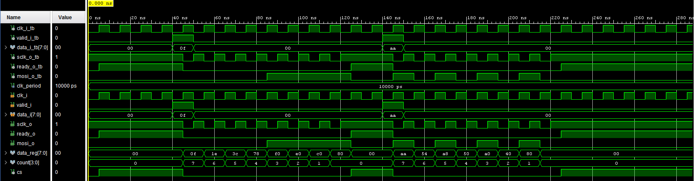
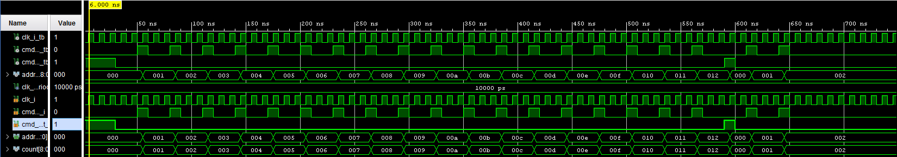
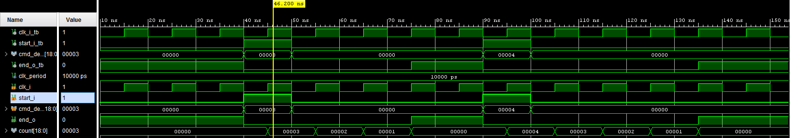
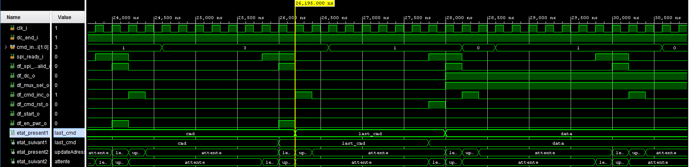
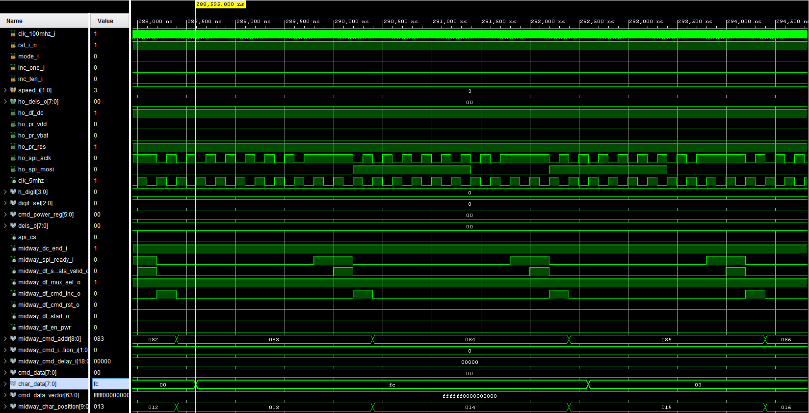

# Digital-Clock
At the core of this project resides a simple programmable clock, relying on cascading BCD counters. From there, an SPI master communicates with an OLED controller, namely the SSD1306. The VHDL description includes the initialization process to power up the OLED display. Then, the SPI transactions are specifically use to transfer data from the clock to the OLED display. 

The FPGA used in this project is the Artix-7 XC7A200T, from Xilinx.
The complete description of the project is presented in the file named "ELE3311 Énoncé Projet 3 - Hiver 2019".

# FSM Flow Chart

# Behavioral simulations

# spi_master

# cmd_addr

# delay_cnt

# display_fsm

# horloge_OLED

